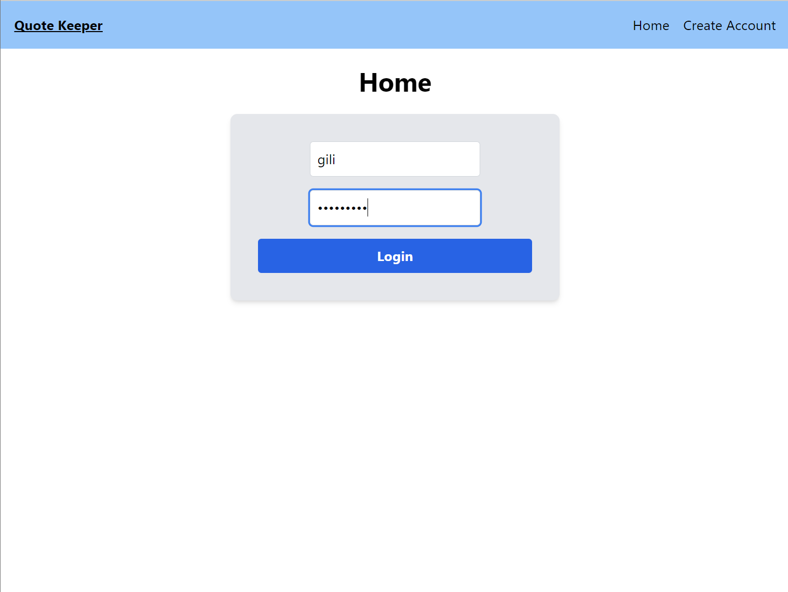
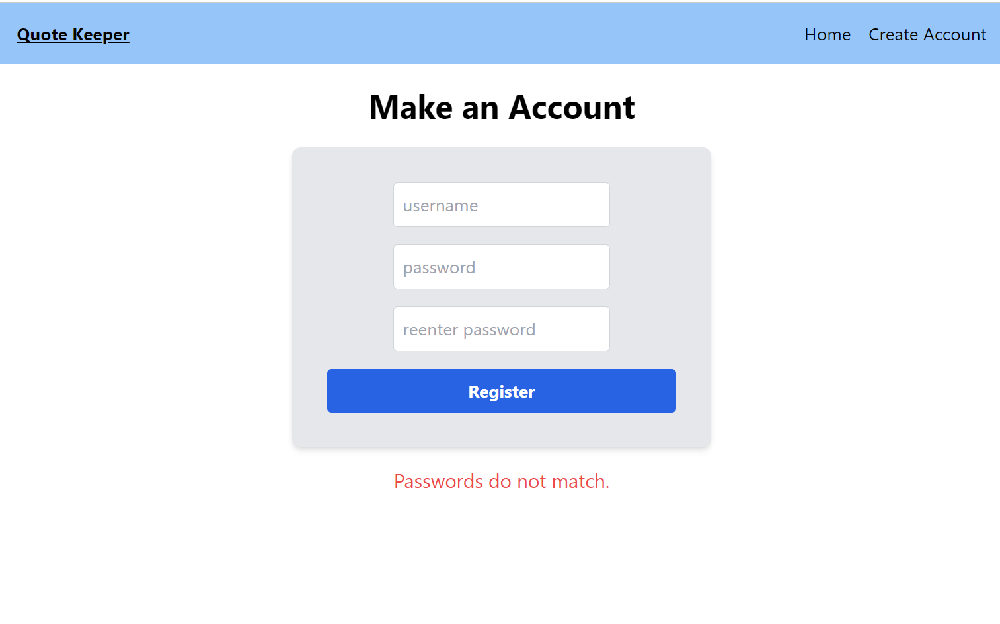
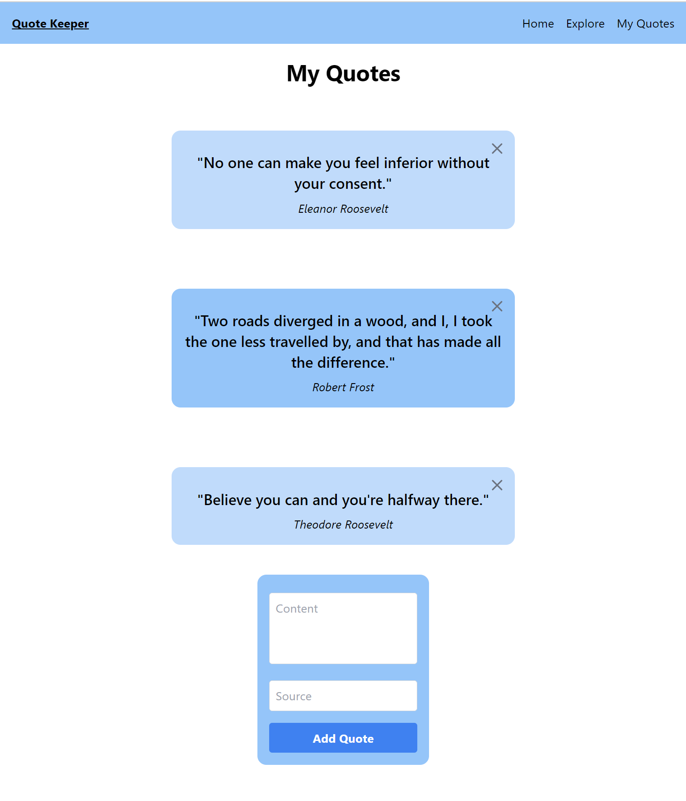
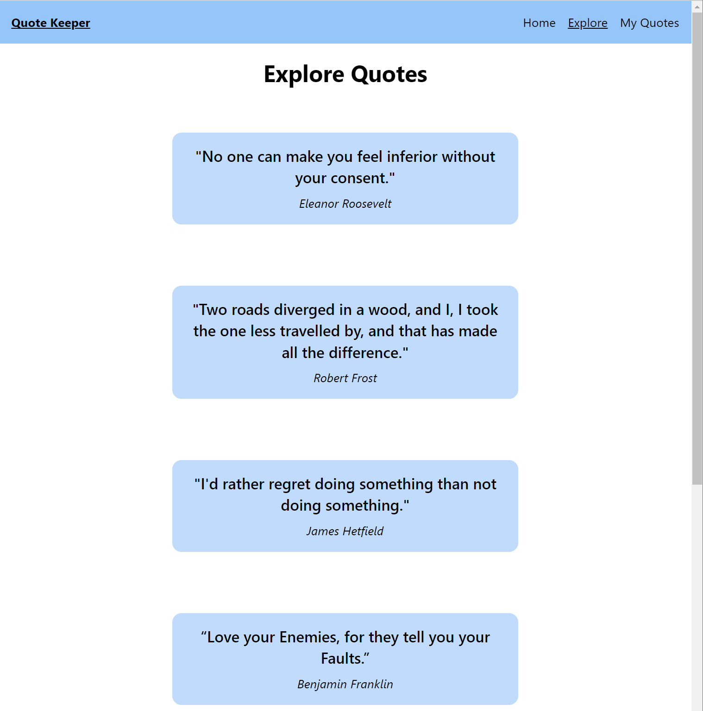
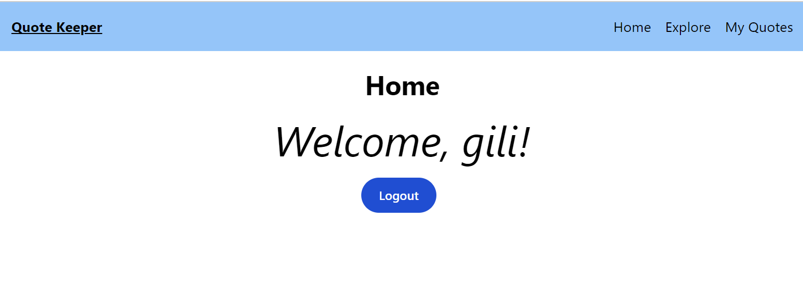

# Quote Keeper

Quote Keeper is a web application that allows users to register, log in, and manage their favorite quotes. Built with a React frontend and a Django REST API backend, this project showcases user authentication, JWT token management, and a responsive design using Tailwind CSS.

## Features

- **User Registration:** New users can create accounts and start saving their quotes.
- **User Authentication:** Secure login using JWT tokens for authentication.
- **Quote Management:** Users can add, view, and delete their quotes, as well as explore quotes created by other users.
- **Responsive Design:** Optimized for both desktop and mobile views.

## Technologies Used

- **Backend:** Django REST Framework, JWT Authentication
- **Frontend:** React, Tailwind CSS, Axios
- **Database:** SQLite

## Demo Images
Home Page prior to login:  

Registration Page, with password check:

User's Quotes page, with creation form and delete functionality:

Explore Page available to authenticated users to view all the quotes in the database:

Home Page post login, with logout functionality:

